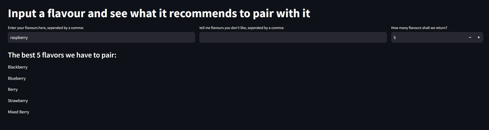

# Flavour Recommender Engine with Market Basket Analysis
William Finch 2025

This project builds a flavor recommender engine that suggests food pairings based on ingredient co-occurrence in a dataset of over 3 million recipes from various sources. The process involves cleaning and standardizing the data.

Note: Raw datasets are not included to save space. Please download them from the links provided in the [Data Loading](notebooks/data_loading.ipynb) notebook.

## File structure
```
├── DS-Final-Project
│   ├── README.md
│   ├── strealit_app.py
│   ├── requirements.txt
│   ├── data
│   │   ├── similarity_matrix.csv
│   ├── images
│   │   ├── GUI.png
│   ├── notebooks
│   │   ├── utils
│   │   │   ├── model_functions.py
│   │   │   └── processing_functions.py
│   │   ├── data_loading.ipynb
│   │   ├── EDA.ipynb
│   │   └── model_building.ipynb
```

## Notebooks

### [Data Loading](notebooks/data_loading.ipynb)
This notebook performs the following:

 - Loads datasets from external sources.

 - Performs basic cleaning to standardize data formats.

 - Saves the cleaned data as a pickle file.

To Use: Download the datasets linked in the notebook and place them in the appropriate directories. Run this notebook first.

### [EDA](notebooks/EDA.ipynb)
This notebook focuses on data cleaning and preprocessing:

 - Removes irrelevant information and filler words.

 - Filters out infrequent ingredients.

To Use: Run this notebook second, make sure the source path for loading the full databases matches that which you used in Data Loading

### [model_building](notebooks/model_building.ipynb)
This notebook builds the ingredient similarity matrix and demonstrates example ingredient pairings.

## Streamlit Application

### [streamlit_app](streamlit_app.py)
This file contains the code for the user-friendly Streamlit web application, which provides a GUI for the flavor recommender engine.

Hosted at [Streamlit](https://flavour-recommender.streamlit.app/)
